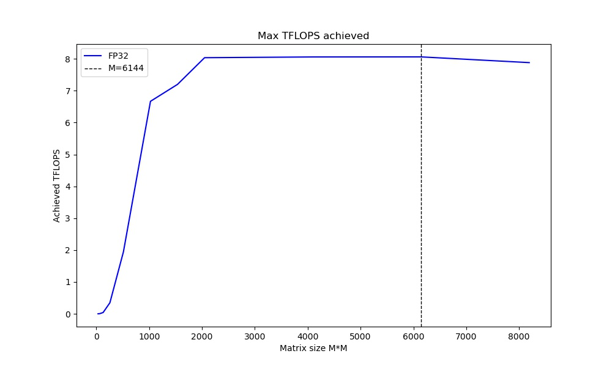

# tf-metal-experiments

TensorFlow Metal Backend on Apple Silicon Experiments (just for fun)

## Setup

This is tested on M1 series Apple Silicon SOC only. 

### TensorFlow 2.x

1. Follow the official instructions from Apple [here](https://developer.apple.com/metal/tensorflow-plugin/)
2. Test that your Metal GPU is working by running `tf.config.list_physical_devices("GPU")`, you should see 1 GPU present (it is not named). Later when you actually use the GPU, there will be a more informative printout that says `Metal device set to: Apple M1 Max` or similar.
3. Now you should be ready to run any TF code that doesn't require external libraries.

### HuggingFace Transformers library

If you want to play around with Transformer models (with TF Metal backend of course), you will need to install the HuggingFace Transformers library.

1. Install the `regex` library (I don't know why it has to be like this, but yeah): `python3 -m pip install --upgrade regex --no-use-pep517`. You might need do `xcode-select --install` if the above command doesn't work.
2. `pip install transformers ipywidgets`

## Experiments and Benchmarks

After some trial and error, some initial benchmarks for what should be the approx best capability of the M1 Max. For all the cases here, increasing batch size does not seem to increase the throughput.

Power draw also doesn't seem to be able to exceed 40W. Power draw from the GPU (averaged over 1 second) can be measured with `sudo powermetrics --samplers gpu_power -i1000 -n1`.

| Model       | GPU        | BatchSize | Throughput  | Power | Memory |
| ----------- | ---------- | --------- | ----------- | ----- | ------ |
| ResNet50    | M1 Max 32c | 64        | 135 img/sec | 40W   | 13 GB  |
| MobileNetV2 | M1 Max 32c | 128       | 352 img/sec | 37W   | 15 GB  |
| DistilBERT  | M1 Max 32c | 64        | 120 seq/sec | 35W   | 9 GB   |
| BERTLarge   | M1 Max 32c | 32        | 18 seq/sec  | 36W   | 14 GB  |

The benchmark scripts used are included in this repo.

**Reference Benchmarks from RTX 3090**

| Model       | GPU        | BatchSize | Throughput  | Power |
| ----------- | ---------- | --------- | ----------- | ----- |
| ResNet50    | 3090       | 64        | 957 img/sec | 300W  |
| MobileNetV2 | 3090       | 128       | 1927 img/sec| 310W  |
| DistilBERT  | 3090       | 64        | 1040 seq/sec| 310W  |
| BERTLarge   | 3090       | 32        | 164 seq/sec | 320W  |

For 3090, same script is used, but additional optimization that leverage hardware (Tensor Core) and software (XLA compiler) not present/working on M1 is added. This corresponds to the following code segment added:

```python
from tensorflow.keras import mixed_precision
tf.config.optimizer.set_jit(True)
policy = mixed_precision.Policy('mixed_float16')
mixed_precision.set_global_policy(policy)
```

Also note that the 3090 is likely to perform better at larger batch sizes. 

## Measuring Achievable TFLOPS

We can use TF to write a matrix multiplication benchmark to try and estimate what is the max compute performance we can get out of a M1 Max. It seems we can get around ~8 TFLOPS for large enough problem (GEMM) sizes.



The plot can be generated using `tflops_sweep.py`. 

Note that FP64 and FP16 performance appears to be non-existent. (the code automatically runs on CPU if FP64 or FP16 is specified as data type)
